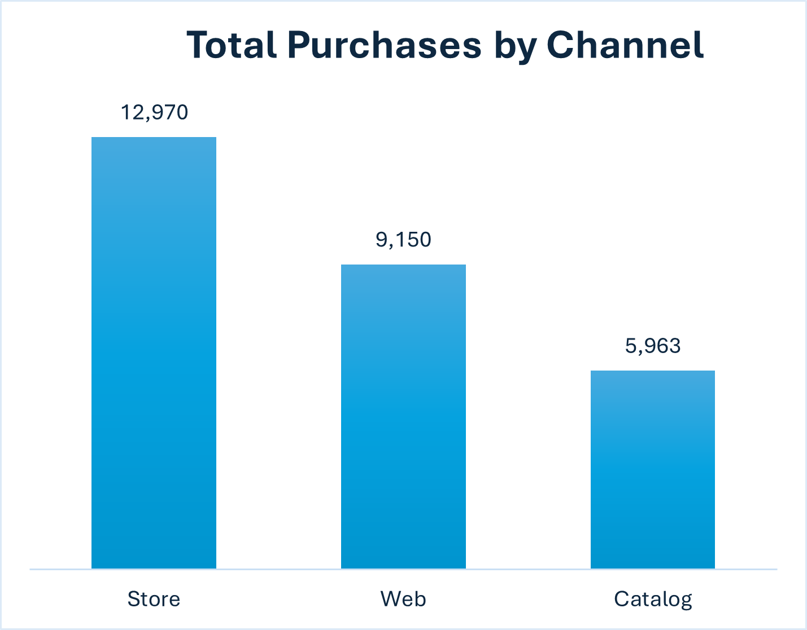
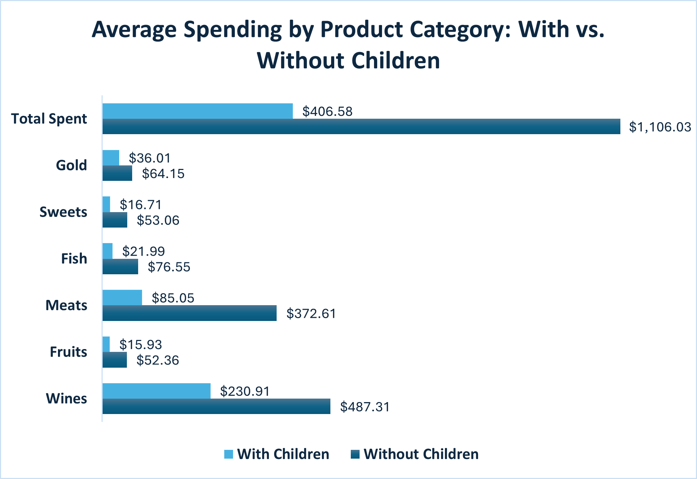
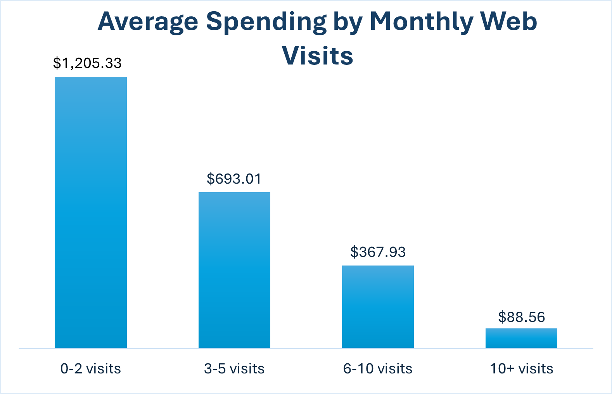

# Marketing Campaign Analysis (SQL Project)

**Data Analysis Project | SQL | Excel Visualization**

 

---

## 1. Project Overview
This project analyzes customer behavior and marketing campaign effectiveness using **SQL** for data extraction, cleaning, and analysis. The final strategic insights are visualized using **Excel**.

---

## 2. Key Business Questions Addressed
This analysis was designed to answer critical strategic questions about customer behavior and marketing effectiveness:

* Which channel represents the majority of purchases: web, catalog, or store?
* How can we classify customers into high, medium, or low spenders based on total purchases?
* Which marketing campaign had the highest acceptance rate?
* How does having children impact spending on specific product categories?
* What is the relationship between customer recency (days since last purchase) and total spending?
* Do more web visits per month correlate with higher spending?

---

## 3. Key Visuals from the Analysis

---

## 4. 🚀 Full Report & SQL Queries
The complete strategic analysis, methodology, and detailed recommendations for each business question are available in the full PDF report.

All SQL scripts used for extraction, transformation, and analysis are available in the `SQL_Queries` folder.

➡️ **[View Full Project Report (PDF)](./Hugo_Salinas_SQL_Marketing_Analysis.pdf)**

➡️ **[Browse the SQL Query Files](./SQL_Queries/)**

---

## 5. Tools & Stack
* **Analysis:** SQL (for extraction, transformation, cleaning, and analysis)
* **Visualization:** Microsoft Excel (Pivot Tables, Charts)
* **Data Source:** Kaggle (Marketing Campaign Dataset)